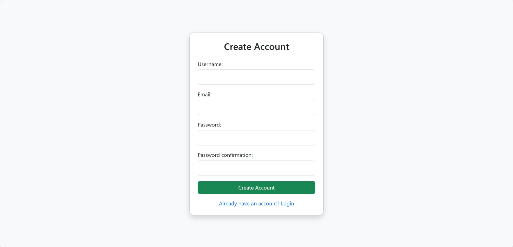
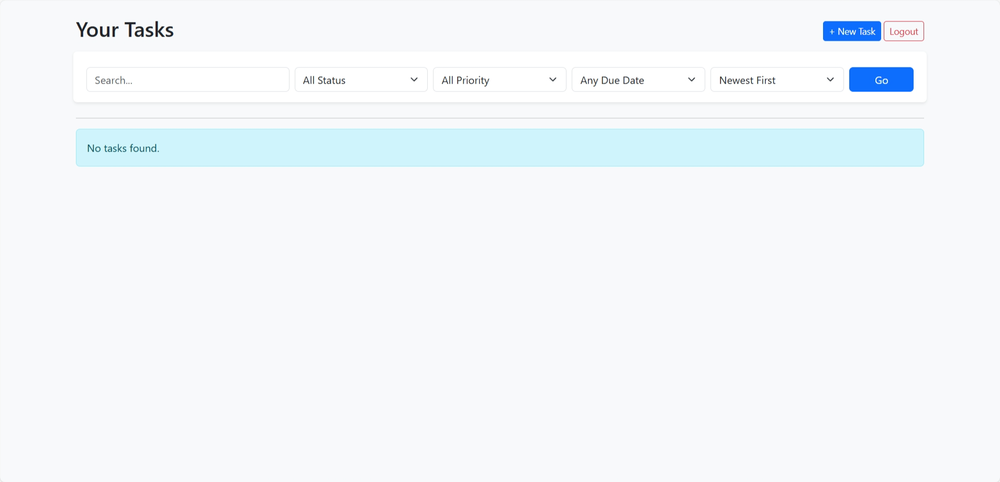
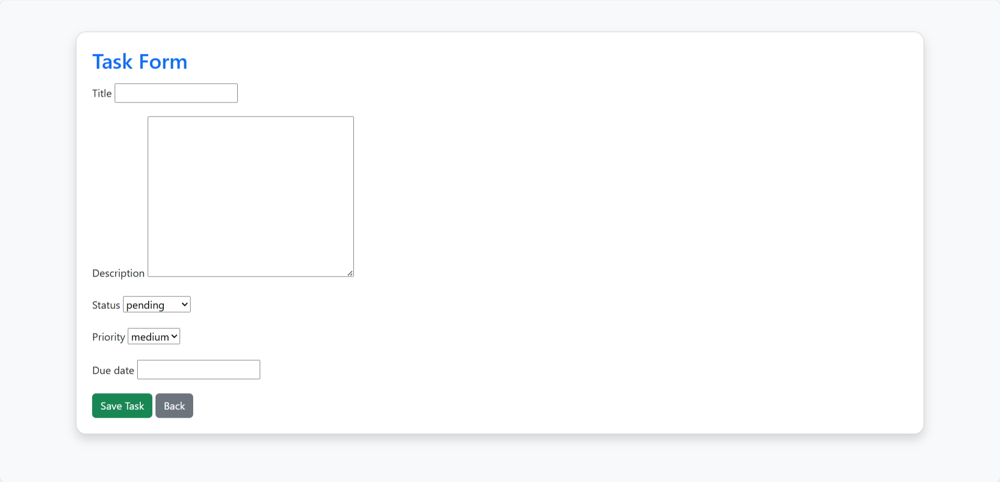
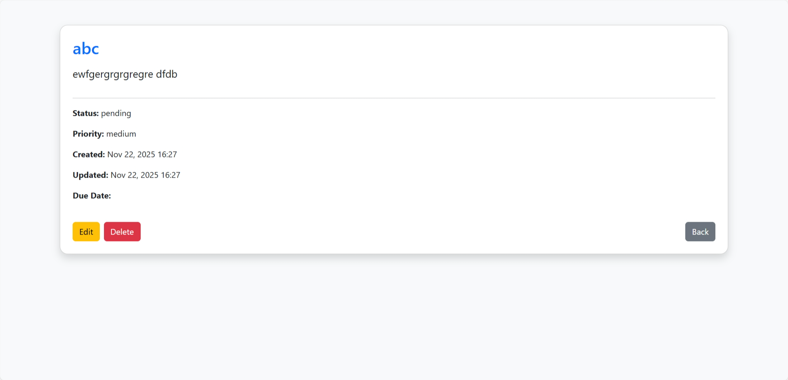

# 📝 Task Manager – Django Project  
A full-featured Task Management System built with Django for Module 19 Assignment.


---

## ⚙️ Setup Instructions

Follow these steps to set up and run the project.

### **1. Clone the Repository**
```bash
git clone https://github.com/Azizul20/taskManager.git
cd taskmanager
```
### **2. Create a Virtual Environment**
```bash
python -m venv venv
```
Activate it:
**Windows**
```bash
venv\Scripts\activate
```
### **3. Install Dependencies**
```bash
pip install -r requirements.txt
```
### **4. Apply Migrations**
```bash
python manage.py makemigrations
python manage.py migrate
```
### **6. Run Development Server**
```bash
python manage.py runserver
```
---


## 📌 Problem Statement

The objective of this project is to build a **Task Management System** using Django that supports:

- User Registration, Login, Logout
- Task CRUD operations (Create, Read, Update, Delete)
- Showing only the tasks created by the logged-in user
- Preventing users from viewing or editing others’ tasks
- Filtering tasks by status, priority, due date, sorting
- Searching tasks by title and description
- Task details page with secure access
- Delete confirmation page


## 📸 Screenshots

### 🔐 Signup Page


### 🔐 Login Page


### 📋 Task List


### ➕ Create Task


### ℹ Task Details

